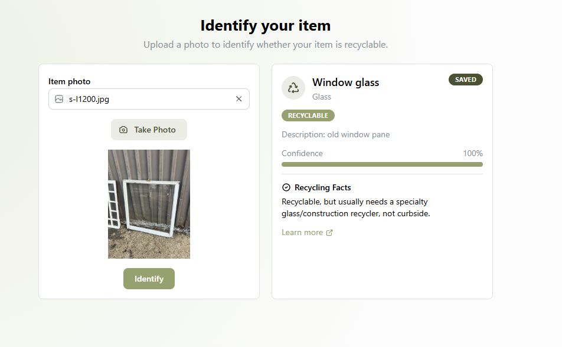
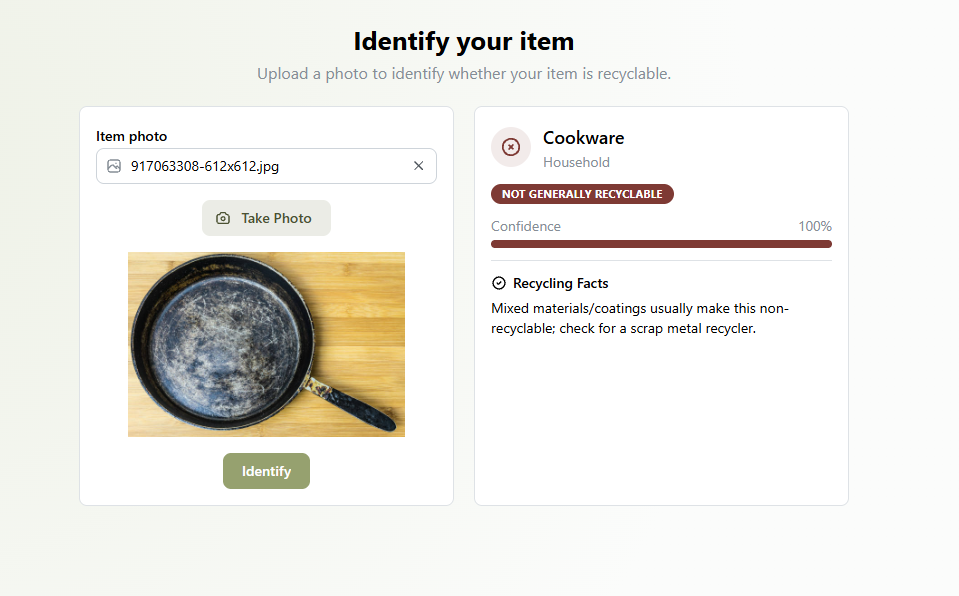
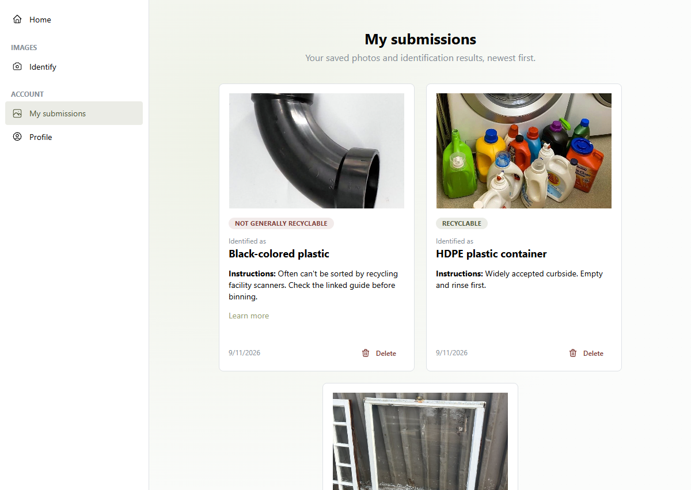

# Recycling Web App

Snap a photo of an item and find out if and how it can be recycled. Powered by Gemini AI image recognition and a curated material database.

[Try the live app](https://canirecycleit.netlify.app/landing)

## Key Features

- **Photo-based material identification:** Gemini identifies what's in your photo, and returns its material along with a confidence rating and description.
- **Material-specific recycling guidance:** Identification results are matched with a curated database of general recycling facts.
- **Personal submission history:** Create an account to save and revisit previous submissions.

## App Preview

### Image Results

### Account Submission History

## Tech Stack

- **Frontend:** React, Vite, Mantine
- **Backend:** Flask (image identification API)
- **Database/Auth:** Supabase (Postgres, RLS, Auth, Storage)
- **Hosting:** Netlify and PythonAnywhere

## How It Works

The React frontend sends an uploaded image to a Flask API. The image is compressed and sent to Gemini for identification. The identified material is then matched with a general recycling facts table to build the result shown to the user.

Supabase provides authentication, Postgres data storage, and image storage. Row Level Security (RLS) controls access to user data.

Recycling guidance is general; local acceptance rules may vary.

## Technical Highlights

- **Structured AI responses:** A response schema constrains Gemini’s output to a list of expected fields and supported material types. Pydantic validates the returned data before the application processes it.
- **Database migrations:** Schema changes are tracked in version-controlled migration files, making database changes reproducible.
- **Tested access controls:** An automated RLS test suite checks database access policies against a local Supabase instance. Test users are created and cleaned up automatically.

## Development

See the [development guide](docs/DEVELOPMENT.md) for local setup,
running the app, and database testing.